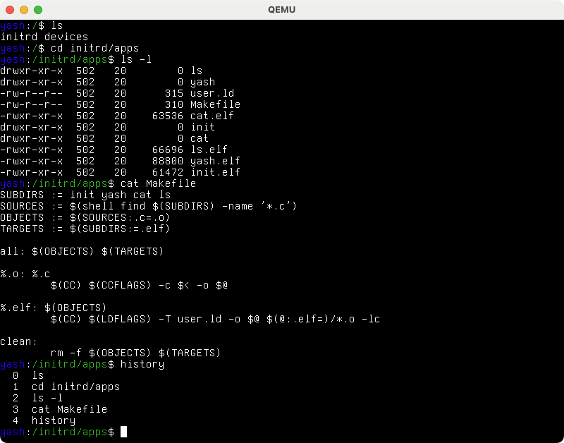

# Novino
**Novino** is a small hobby OS for the x86-64 architecture. There is no goal or higher purpose for the development, I simply find it interesting and I like working on it. The following things are currently implemented, with some things being much more feature complete than others.

- Physical and virtual memory managers
- PCI support, including MSI interrupts
- ACPI support, including AML parsing using [sabi](https://github.com/mrlhansen/sabi)
- SMP support, including multi-core scheduling of threads
- Framebuffer and text mode console, multiple virtual terminals, ANSI escape codes
- USB support and XHCI driver (keyboards and hubs supported)
- Virtual file system (with devfs and initrd as implemented filesystems)
- Support for loading and running user mode programs
- (Partial) implementation of `libc` for user space programs

Here is a screenshot of the `yash` shell running in user space. There are multiple virtual terminals and you can use `ctrl+alt+fX` to swap between them. The last terminal (under `ctrl+alt+f6`) is the kernel message log.

## Compiling
You need GCC and NASM to compile the source code, and for GCC you need a proper cross compiler. To build a cross compiler, the script `toolchain.sh` can be used. It will download and compile binutils, GCC and GRUB with the right configuration options and install them under `~/osdev/x86_64`. Be aware that all dependencies for GCC must be present on the system, these are not automatically compiled.

There are two primary scripts for compiling and running the OS in an emulator.

* `build.sh` is the primary build script, it will compile everything and call some of the other scripts as needed.

* `run.sh` will create an ISO file using `grub-mkrescue` and run the OS using qemu.

There are some extra scripts, which can be called if needed.

* `sabi.sh` will clone the [sabi](https://github.com/mrlhansen/sabi) repository and copy the files into the `sabi` folder.

* `libc.sh` will compile the C library for user space applications.

* `env.sh` contains environment variables and compile flags. You will have to adjust the `PATH` variable for finding the right cross compiler.
